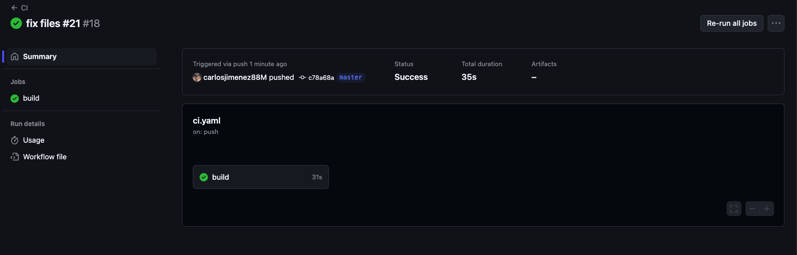
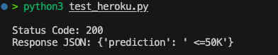
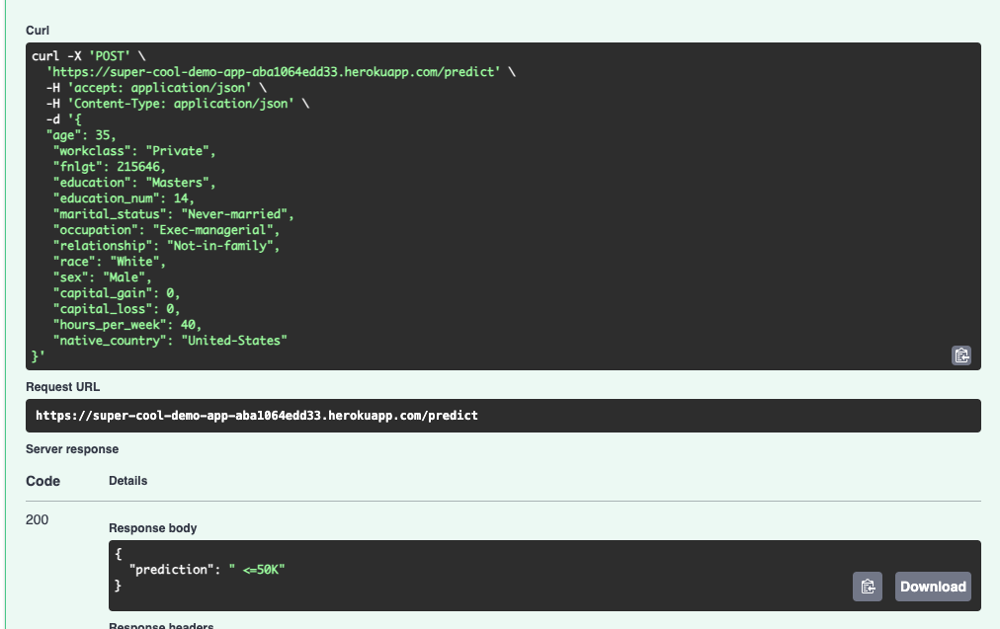

# heroku


**API (FastAPI) Description**  
Below is an example of how to interact with the deployed FastAPI endpoint via GET and POST:


- **GET** request (root endpoint example):
  ```bash
  curl -X GET https://super-cool-demo-app-aba1064edd33.herokuapp.com/
  ```
  This should return a basic greeting or status message.

- **POST** request (`/predict` endpoint example):
  ```bash
  curl -X POST -H "Content-Type: application/json" \
  -d '{
    "age": 35,
    "workclass": "Private",
    "fnlgt": 215646,
    "education": "Masters",
    "education_num": 14,
    "marital_status": "Never-married",
    "occupation": "Exec-managerial",
    "relationship": "Not-in-family",
    "race": "White",
    "sex": "Male",
    "capital_gain": 0,
    "capital_loss": 0,
    "hours_per_week": 40,
    "native_country": "United-States"
  }' \
  https://super-cool-demo-app-aba1064edd33.herokuapp.com/predict
  ```

**Example Python script** (`test_heroku.py`) that sends a POST request to the live API:
```python
import requests

HEROKU_API_URL = "https://super-cool-demo-app-aba1064edd33.herokuapp.com/predict"

input_data = {
    "age": 35,
    "workclass": "Private",
    "fnlgt": 215646,
    "education": "Masters",
    "education_num": 14,
    "marital_status": "Never-married",
    "occupation": "Exec-managerial",
    "relationship": "Not-in-family",
    "race": "White",
    "sex": "Male",
    "capital_gain": 0,
    "capital_loss": 0,
    "hours_per_week": 40,
    "native_country": "United-States"
}

response = requests.post(HEROKU_API_URL, json=input_data)
print("Status Code:", response.status_code)
print("Response JSON:", response.json())
```

**Output from this script**:
```
Status Code: 200
Response JSON: {'prediction': ' <=50K'}
```
This indicates the request succeeded (HTTP 200) and the model returned the prediction `<=50K` for the provided data.


### continuous_deployment



### Live post 


### live get
